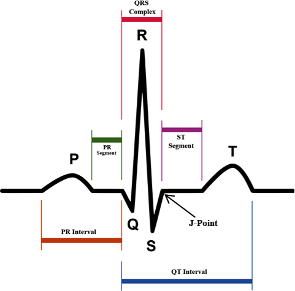
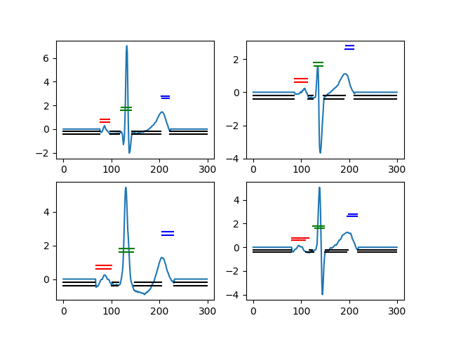
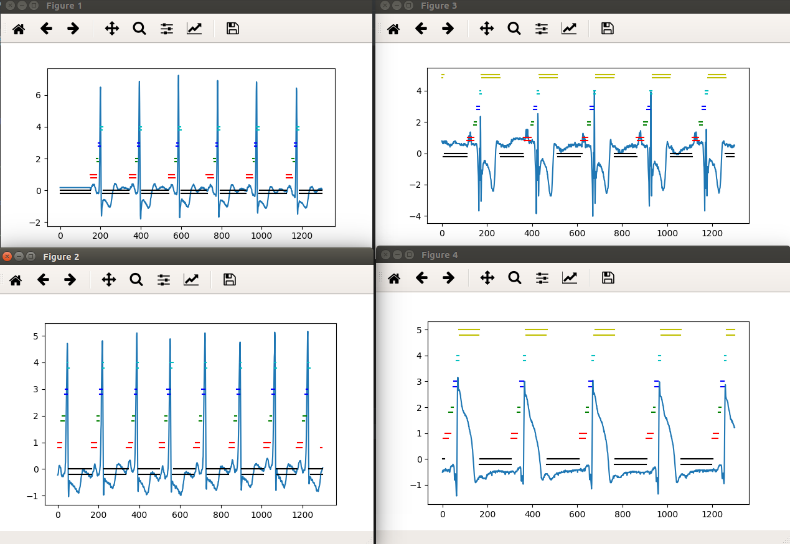

# ECG-Segment-LSTM

ENV:python3 + pytorch1.0.0

Independent Package:wfdb、pickle、numpy、scipy、matplotlib

Used database Url:https://physionet.org/physiobank/database/qtdb/

Ref Rep:https://github.com/niekverw/Deep-Learning-Based-ECG-Annotator

This project achieved ECG signal wave segmentation,by using LSTM net.There are six waves:background/P Segment/PQ Seg/QR Seg/RS Seg/ST Seg,label is 0~6.

## Getting Start

  download qtdb,including .hed .q1c files

  run `python qtdatabase.py`, it will generate train_data.pkl and val_data.pkl in folder "qtdb_pkl"

  run `python model_lstm.py` to training LSTM Net, its result will be in folder "ckpt"

The characteristic waves of a heart beat

Please to read the source code and annotations

## Output

The figure shows the predict and label, for example, a couple of red lines, the upper is label, the lower is predict

several continue heart beat segment, please download branch multi_beats

## Result

| method | P-peak | Q-pose | R-peak | S-pose | T-peak
| ------ | ------ | ------ | ------ | ------ | -----
| our    |0.34±2.92|0.03±0.84|0.03±0.32|0.18±1.00|-0.06±1.29|
| RAN    |-0.4±10.1|-0.7±10.9|NA       |-4.8±13.1|-3.0±10.5|
| CNN    |3.9±14.2 |-0.3±14  |NA       |-6.6±15.2|-4.5±17.2|

|      (ms)|P-peak|Q-pose|R-Peak|S-pose|T-Peak|
|----------|------|------|------|------|-------|
|0.8       |75.96%|84.24%|98.74%|75.95%|72.37% |
|1.2       |88.03%|93.70%|99.58%|87.39%|85.29% |
|1.6       |94.01%|96.95%|99.58%|93.17%|90.86% |

## Network

two-layers bi-LSTM + two Linear layer with dropout + softmax output